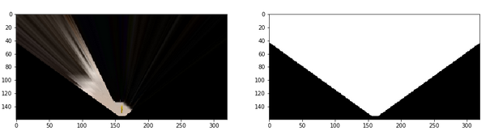
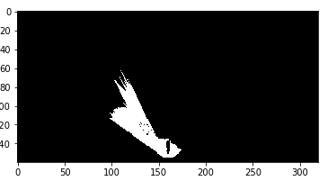
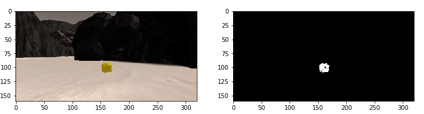
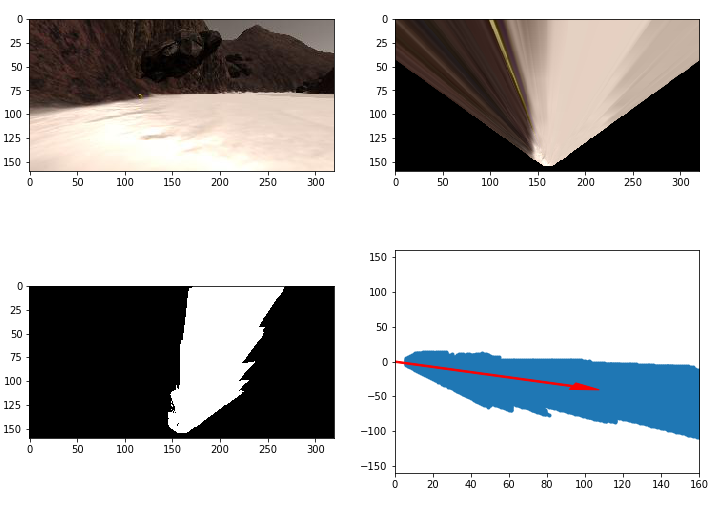
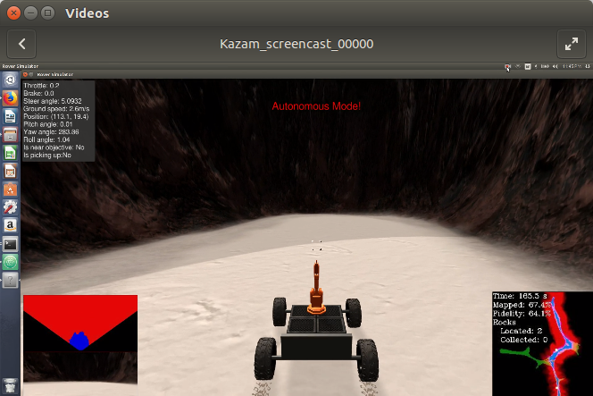

## Project: Search and Sample Return
### Writeup Template: You can use this file as a template for your writeup if you want to submit it as a markdown file, but feel free to use some other method and submit a pdf if you prefer.

---


**The goals / steps of this project are the following:**  

**Training / Calibration**  

* Download the simulator and take data in "Training Mode"
* Test out the functions in the Jupyter Notebook provided
* Add functions to detect obstacles and samples of interest (golden rocks)
* Fill in the `process_image()` function with the appropriate image processing steps (perspective transform, color threshold etc.) to get from raw images to a map.  The `output_image` you create in this step should demonstrate that your mapping pipeline works.
* Use `moviepy` to process the images in your saved dataset with the `process_image()` function.  Include the video you produce as part of your submission.

**Autonomous Navigation / Mapping**

* Fill in the `perception_step()` function within the `perception.py` script with the appropriate image processing functions to create a map and update `Rover()` data (similar to what you did with `process_image()` in the notebook).
* Fill in the `decision_step()` function within the `decision.py` script with conditional statements that take into consideration the outputs of the `perception_step()` in deciding how to issue throttle, brake and steering commands.
* Iterate on your perception and decision function until your rover does a reasonable (need to define metric) job of navigating and mapping.  

## [Rubric](https://review.udacity.com/#!/rubrics/916/view) Points
### Here I will consider the rubric points individually and describe how I addressed each point in my implementation.  

---
### Writeup / README

#### 1. Provide a Writeup / README that includes all the rubric points and how you addressed each one.  You can submit your writeup as markdown or pdf.  

You're reading it!

### Notebook Analysis
#### 1. Run the functions provided in the notebook on test images (first with the test data provided, next on data you have recorded). Add/modify functions to allow for color selection of obstacles and rock samples.

### Perspective Transform
The perspective transform uses the opencv2 library, the first method of the library is `getPerpsctiveTransform()`, this function returns the values in a matrix depending of the source and destination points. After that the matrix is used in the following instruction, the `warpPespective()` is going to display a top-down view of the enviroment. Finally the mask only shows the range of the camera.



### Color Thresholding
The Color Thresholding is very useful to detect different kind of objects, in our simulation it was able to detect not only the navigable path, but also the rock samples.
The desire object is displayed with color gray.





### Coordinate Transformations
The next functions were develop to convert the world reference coodinates to rover coordinates, the main reason of that is because all our rover's commands need to be with respect of the rover's position, so that the `decision.py` functions can work.



#### 2. Populate the `process_image()` function with the appropriate analysis steps to map pixels identifying navigable terrain, obstacles and rock samples into a worldmap.  Run `process_image()` on your test data using the `moviepy` functions provided to create video output of your result.

* The way the `process_image()` was full filled was by applying all the functions above that we developed in the `Jupyter notebook`, The code is:
```python
    warped, mask = perspect_transform(img, source, destination)
    threshed = color_thresh(warped)
    obs_map = np.absolute(np.float32(threshed) - 1) * mask
    xpix, ypix = rover_coords(threshed)
    world_size = data.worldmap.shape[0]
    scale = 2* dst_size
    xpos = data.xpos[data.count-1]
    ypos = data.ypos[data.count-1]
    yaw = data.yaw[data.count-1]
    x_world, y_world = pix_to_world(xpix, ypix, xpos, ypos, yaw, world_size, scale)
    obsxpix, obsypix = rover_coords(obs_map)
    obs_x_world, obs_y_world = pix_to_world(obsxpix, obsypix, xpos, ypos, yaw, world_size, scale)
    data.worldmap[y_world, x_world, 2] = 255
    data.worldmap[obs_y_world, obs_x_world, 0] = 255
    nav_pix = data.worldmap[:,:,2] > 0
    data.worldmap[nav_pix, 0] = 0
    rock_map = find_rocks(warped, levels=(110, 110, 50))
    if rock_map.any():
        rock_x, rock_y = rover_coords(rock_map)
        rock_x_world, rock_y_world = pix_to_world(rock_x, rock_y, xpos, ypos, yaw, world_size, scale)
        data.worldmap[rock_y_world, rock_x_world, :] = 255
```
Basically we evaluate the current images doing `perspect_transform()` and `color_thresh()`, after that we use the some functions to map it into the real world, many data was needed to do the mapping (`xpix`,`ypix`,` obs_map`,`obsxpix`,`obsypix`,`world_size`, `scale`, `xpos`, `ypos`, `yaw`). Once we have the values `x_world`, `y_world`, `obs_x_world` and `obs_y_world` we update the `data.worldmap` and represent both of them with colors.


### Autonomous Navigation and Mapping

#### 1. Fill in the `perception_step()` (at the bottom of the `perception.py` script) and `decision_step()` (in `decision.py`) functions in the autonomous mapping scripts and an explanation is provided in the writeup of how and why these functions were modified as they were.

For this project the data capture of the `perception_step()` goes to the instance of the class `RoverState()`. All functions we develop during the quizzes were really helpful in order to develop this function. The `perception.py` had all the functions, in the 'perception_step' we applied the functions to determine the rock samples, obstacles, and the navigable terrain.

* First of all we needed to find the rocks samples, for this we use certain values for the threshold in order to identify which objects are rocks, the simulation make it easy to do this because the rocks color is yellow. The `find_rocks` use the values of the threshold and the current image (`Rover.img`) and if conditions are true, it will show the rock sample.

* We did almost the same steps as in the Jupyter notebook, we defined our source and description points, then we applied the `perspect_transform` to the current image and we created a mask, after that we mapped the rover coords with the functions `rover_coords` and pass them into the `pix_to_world`.

#### 2. Launching in autonomous mode your rover can navigate and map autonomously.  Explain your results and how you might improve them in your writeup.  

* Screen resolution: 1920x1080; Graphics quality: Good; FPS output to terminal: 13-15, follow the link to watch the video. 
<a href="https://www.youtube.com/watch?v=XILRbSKBlKc"
alt="IMAGE ALT TEXT HERE" width="240" height="180" border="10" /></a>

* Rover performance is good enough, it mapped 60-75% of the world with 60-70% fidelity. However, the problem is that the `decision.py` is not completetly develop, the decision making of the rover is too simple and also the velocity of the rover is quite slow.



* In order to make the rover more efficient, many improvements are needed: First, the rover can throttle whenever the path has a lot of navigable terrain. Another important change might be that the rover can remembered the paths that he already visited and to make the decision with that information.
